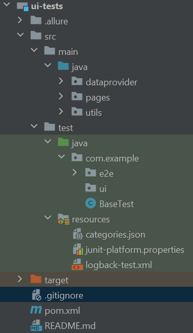
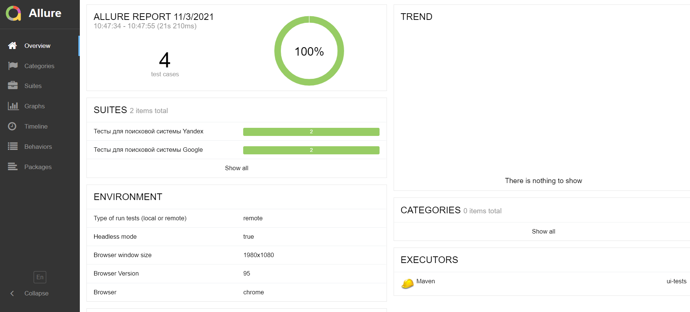

## Framework for automated acceptance tests.


**Stack:**

[Java 8;](https://www.javacodegeeks.com/java-8-features-tutorial.html?utm_content=buffer32138&utm_medium=social&utm_source=twitter.com&utm_campaign=bufferextended_annotations_supportdate/Time_API_(JSR%20310)_Interface’s_Default_andstreamsnew_java_tools/#repeating_annotations)

[JUnit5;](https://junit.org/junit5/docs/current/user-guide/#overview)

[Allure 2.13.8;](https://docs.qameta.io/allure/)

[Selenide](https://ru.selenide.org/)


**Patterns:**

PO / Decorator

[Useful](https://habr.com/ru/company/jugru/blog/338836/)


**Project structure:**




**Preconditions:**

- Install tools
    - [install JAVA](https://www.oracle.com/java/technologies/javase/javase-jdk8-downloads.html)
    - [install GIT](https://git-scm.com/book/ru/v2/Введение-Установка-Git)
    - [install Maven](https://habr.com/ru/post/77382/)
    - [install Allure CLI](https://docs.qameta.io/allure/)
    - [install IDEA](https://www.jetbrains.com/help/idea/installation-guide.html)
    - [install DOCKER](https://docs.docker.com/docker-for-windows/install/)
    - [install Selenide](https://4te.me/post/selenium-docker/)

- Clone project
    - [create local repo: git init](https://git-scm.com/book/ru/v2/Основы-Git-Создание-Git-репозитория)
    - [clone repo by https](https://git-scm.com/docs/git-clone)

- Open project in IDEA
    - [open/import](https://www.jetbrains.com/help/idea/import-project-or-module-wizard.html)


**Run tests:**

To start UI tests run next commands from the project root directory:
```
$ mvn clean test -Denv=local -Dselenide.headless=true
```

To open Allure with results of tests run:
```
$ allure serve {Project location}\target\allure-results
```
**Report example:**




**Troubleshooting:**
